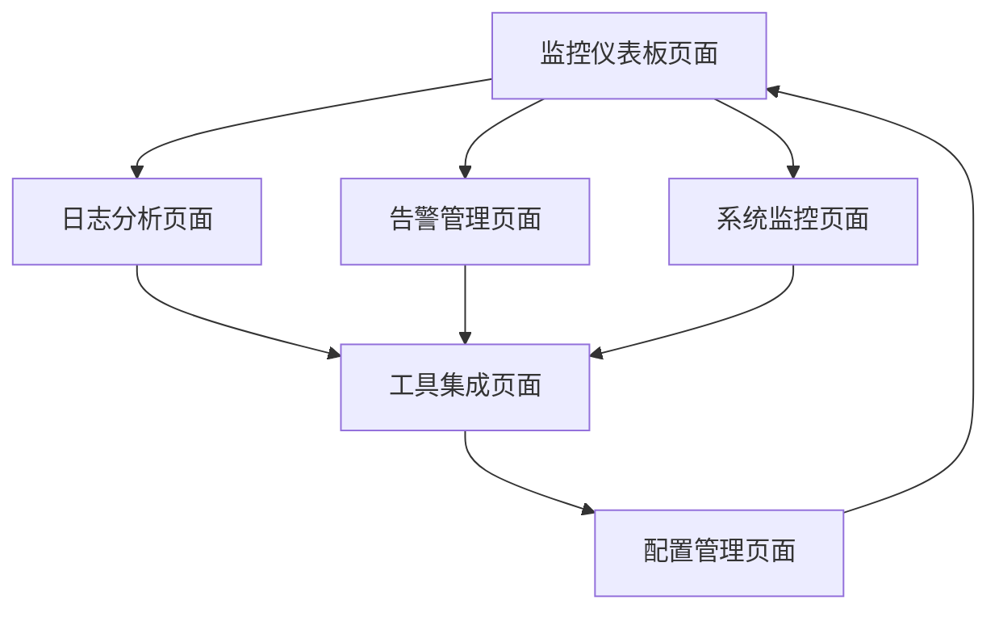

# 综合运维平台产品需求文档

## 1. 产品概述

综合运维平台是一个集成化的运维管理系统，旨在统一管理和监控企业IT基础设施。

该平台通过集成ELK（Elasticsearch、Logstash、Kibana）、Prometheus、Grafana等主流监控工具，为运维团队提供统一的监控视图、日志分析、告警管理和自动化运维能力，显著提升运维效率和系统可靠性。

目标是构建企业级运维管理中心，降低运维成本，提高系统稳定性和故障响应速度。

## 2. 核心功能

### 2.1 用户角色

| 角色 | 注册方式 | 核心权限 |
|------|----------|----------|
| 系统管理员 | 内部分配账号 | 全平台管理权限，用户管理，系统配置 |
| 运维工程师 | 管理员创建账号 | 监控查看，告警处理，日志分析，基础配置 |
| 开发人员 | 申请开通权限 | 应用监控查看，日志查询，性能分析 |
| 业务负责人 | 邮箱注册 | 业务监控概览，关键指标查看 |

### 2.2 功能模块

我们的综合运维平台包含以下主要页面：

1. **监控仪表板页面**：实时监控概览，关键指标展示，系统健康状态
2. **日志分析页面**：ELK集成，日志搜索分析，错误日志统计
3. **告警管理页面**：告警规则配置，告警历史查看，通知管理
4. **系统监控页面**：Prometheus集成，服务器性能监控，资源使用统计
5. **工具集成页面**：第三方工具接入，API管理，插件配置
6. **配置管理页面**：系统配置，用户权限管理，集成设置

### 2.3 页面详情

| 页面名称 | 模块名称 | 功能描述 |
|----------|----------|----------|
| 监控仪表板页面 | 实时监控面板 | 展示系统整体健康状态，CPU、内存、网络等关键指标的实时图表 |
| 监控仪表板页面 | 服务状态概览 | 显示各个服务的运行状态，响应时间，可用性统计 |
| 监控仪表板页面 | 快速操作区 | 提供常用运维操作快捷入口，如重启服务、清理缓存等 |
| 日志分析页面 | ELK集成模块 | 连接Elasticsearch，实现日志的统一收集、存储和检索 |
| 日志分析页面 | 日志搜索引擎 | 支持复杂查询语法，时间范围筛选，关键词高亮显示 |
| 日志分析页面 | 错误分析统计 | 自动识别错误日志，生成错误趋势图，异常模式分析 |
| 告警管理页面 | 告警规则引擎 | 创建和管理告警规则，支持多种触发条件和阈值设置 |
| 告警管理页面 | 通知中心 | 配置邮件、短信、钉钉等多种告警通知方式 |
| 告警管理页面 | 告警历史记录 | 查看历史告警信息，告警处理状态跟踪，统计分析 |
| 系统监控页面 | Prometheus集成 | 接入Prometheus监控数据，展示详细的系统性能指标 |
| 系统监控页面 | 性能图表展示 | 生成CPU、内存、磁盘、网络等性能趋势图表 |
| 系统监控页面 | 容器监控 | 支持Docker、Kubernetes容器监控，资源使用分析 |
| 系统监控页面 | 服务连通性监控 | 实时检测各服务间的网络连通性，端口可达性测试，连接延迟监控 |
| 工具集成页面 | API接口管理 | 管理第三方工具的API接入，认证配置，数据同步 |
| 工具集成页面 | 插件市场 | 提供常用运维工具插件，支持一键安装和配置 |
| 工具集成页面 | 自定义集成 | 支持自定义脚本和工具集成，扩展平台功能 |
| 配置管理页面 | 系统设置 | 平台基础配置，数据库连接，缓存设置等 |
| 配置管理页面 | 用户权限管理 | 用户账号管理，角色权限分配，访问控制配置 |
| 配置管理页面 | 集成配置中心 | 管理各种监控工具的连接配置，数据源设置 |

## 3. 核心流程

**系统管理员流程：**
系统管理员登录后进入监控仪表板页面查看整体状态，然后进入配置管理页面进行用户管理和系统配置，最后在工具集成页面添加新的监控工具。

**运维工程师流程：**
运维工程师从监控仪表板开始日常巡检，发现异常后进入日志分析页面排查问题，在告警管理页面处理告警，最后在系统监控页面进行深度性能分析。

**开发人员流程：**
开发人员主要使用日志分析页面查看应用日志，在系统监控页面查看应用性能指标，通过监控仪表板了解服务运行状态。

## 4. 用户界面设计

### 4.1 设计风格

- **主色调**：深蓝色 (#1f2937) 作为主色，浅蓝色 (#3b82f6) 作为辅助色
- **按钮样式**：圆角矩形按钮，支持悬停效果和点击反馈
- **字体**：主要使用 16px 的 Inter 字体，标题使用 18-24px
- **布局风格**：卡片式布局，左侧导航栏，顶部状态栏设计
- **图标风格**：使用 Heroicons 图标库，简洁现代的线性图标

### 4.2 页面设计概览

| 页面名称 | 模块名称 | UI元素 |
|----------|----------|--------|
| 监控仪表板页面 | 实时监控面板 | 网格布局的监控卡片，实时数据图表，绿色/红色状态指示器 |
| 监控仪表板页面 | 服务状态概览 | 服务列表表格，状态徽章，响应时间进度条 |
| 日志分析页面 | ELK集成模块 | 搜索输入框，时间选择器，日志列表，语法高亮显示 |
| 日志分析页面 | 错误分析统计 | 错误趋势折线图，饼图分布，错误级别颜色编码 |
| 告警管理页面 | 告警规则引擎 | 规则配置表单，条件构建器，阈值滑块控件 |
| 告警管理页面 | 通知中心 | 通知方式选择器，联系人管理表格，测试发送按钮 |
| 系统监控页面 | Prometheus集成 | 指标选择下拉框，时间范围选择器，多维度图表展示 |
| 系统监控页面 | 性能图表展示 | 响应式图表容器，图例说明，数据导出功能 |
| 系统监控页面 | 服务连通性监控 | 服务拓扑图，连通性状态矩阵，延迟热力图，端口扫描结果表格 |
| 工具集成页面 | API接口管理 | API列表卡片，连接状态指示，配置弹窗表单 |
| 工具集成页面 | 插件市场 | 插件网格布局，安装进度条，评分星级显示 |
| 配置管理页面 | 系统设置 | 分组配置面板，开关切换器，保存确认对话框 |
| 配置管理页面 | 用户权限管理 | 用户表格，权限矩阵，角色标签，操作按钮组 |

### 4.3 响应式设计

平台采用桌面优先的响应式设计，支持移动端适配。在移动设备上，导航栏会折叠为汉堡菜单，图表会自动调整为垂直布局，表格支持横向滚动。考虑到运维人员的使用场景，优化了触摸交互体验，增大了按钮点击区域。