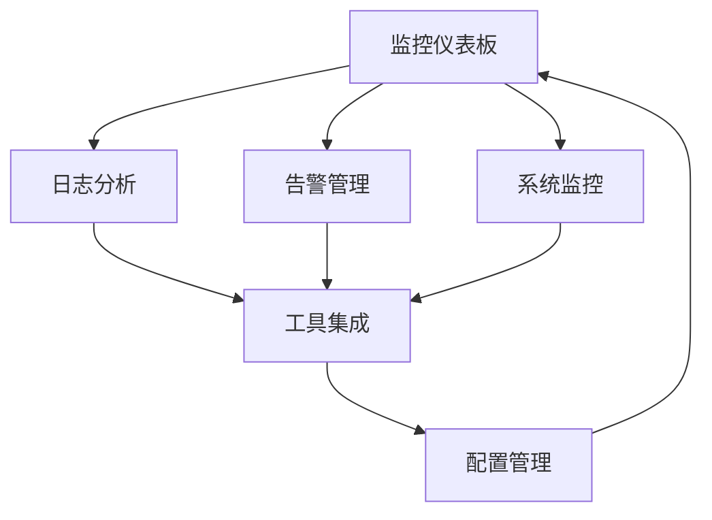

# OneOps - 综合运维平台

一个集成化的企业级运维管理系统，统一管理和监控IT基础设施，提供实时监控、日志分析、告警管理和自动化运维能力。

## 🚀 项目概述

综合运维平台通过集成ELK（Elasticsearch、Logstash、Kibana）、Prometheus、Grafana等主流监控工具，为运维团队提供统一的监控视图、日志分析、告警管理和自动化运维能力，显著提升运维效率和系统可靠性。

## ✨ 核心功能

### 📊 监控仪表板
- 实时系统健康状态监控
- CPU、内存、网络等关键指标展示
- 服务状态概览和可用性统计
- 快速运维操作入口

### 📝 日志分析
- ELK集成，统一日志收集和检索
- 复杂查询语法支持，关键词高亮
- 错误日志自动识别和趋势分析
- 自适应屏幕的响应式日志显示

### 🚨 告警管理
- 灵活的告警规则引擎
- 多种通知方式（邮件、短信、钉钉）
- 告警历史记录和处理状态跟踪

### 🖥️ 系统监控
- Prometheus集成，详细性能指标
- CPU、内存、磁盘、网络趋势图表
- Docker、Kubernetes容器监控
- 服务连通性和端口可达性监控

### 🔧 工具集成
- 第三方工具API接入管理
- 插件市场和一键安装
- 自定义脚本和工具集成

### ⚙️ 配置管理
- 系统基础配置和数据源设置
- 用户权限管理和角色分配
- 自定义索引管理（支持管理员配置，用户选择）

## 🛠️ 技术栈

### 前端
- **框架**: React 18 + TypeScript
- **构建工具**: Vite 6
- **路由**: React Router DOM 7
- **状态管理**: Zustand
- **UI组件**: Tailwind CSS + Lucide React
- **图表库**: Recharts
- **通知**: Sonner

### 后端
- **语言**: Python
- **框架**: Flask
- **API**: RESTful API

### 开发工具
- **代码检查**: ESLint + TypeScript ESLint
- **样式**: PostCSS + Autoprefixer
- **类型检查**: TypeScript 5.8

## 📦 安装和运行

### 环境要求
- Node.js 18+
- Python 3.8+
- npm 或 pnpm

### 前端安装

```bash
# 克隆项目
git clone <repository-url>
cd rify

# 安装依赖
npm install

# 启动开发服务器
npm run dev
```

### 后端安装

```bash
# 进入后端目录
cd backend

# 创建虚拟环境
python3 -m venv venv
source venv/bin/activate  # Linux/Mac
# 或 venv\Scripts\activate  # Windows

# 安装依赖
pip install -r requirements.txt

# 启动后端服务
python3 app.py
```

### 开发命令

```bash
# 前端开发
npm run dev          # 启动开发服务器
npm run build        # 构建生产版本
npm run preview      # 预览生产版本
npm run lint         # 代码检查
npm run check        # TypeScript类型检查

# 后端开发
cd backend
python3 app.py       # 启动后端服务
```

## 🌐 访问地址

- **前端**: http://localhost:5173
- **后端API**: http://localhost:8001

## 👥 用户角色

| 角色 | 权限描述 |
|------|----------|
| 系统管理员 | 全平台管理权限，用户管理，系统配置 |
| 运维工程师 | 监控查看，告警处理，日志分析，基础配置 |
| 开发人员 | 应用监控查看，日志查询，性能分析 |
| 业务负责人 | 业务监控概览，关键指标查看 |

## 📱 响应式设计

平台采用桌面优先的响应式设计，完美支持：
- 🖥️ 桌面设备（1920px+）
- 💻 笔记本电脑（1024px+）
- 📱 平板设备（768px+）
- 📱 移动设备（320px+）

特别优化了日志显示的自适应功能，确保在任何屏幕尺寸下都能完美显示，支持文本自动换行，无需水平滚动。

## 🎨 设计特色

- **现代化界面**: 深色主题，卡片式布局
- **终端风格**: 日志显示采用经典的绿色文本配黑色背景
- **直观操作**: 简洁的导航和快捷操作
- **数据可视化**: 丰富的图表和实时数据展示

## 🔄 核心工作流程



## 📄 许可证

MIT License

## 🤝 贡献

欢迎提交Issue和Pull Request来帮助改进项目。

## 📞 联系方式

如有问题或建议，请通过以下方式联系：
- 提交Issue
- 发送邮件

---

**OneOps综合运维平台** - 让运维更简单，让监控更智能 🚀
